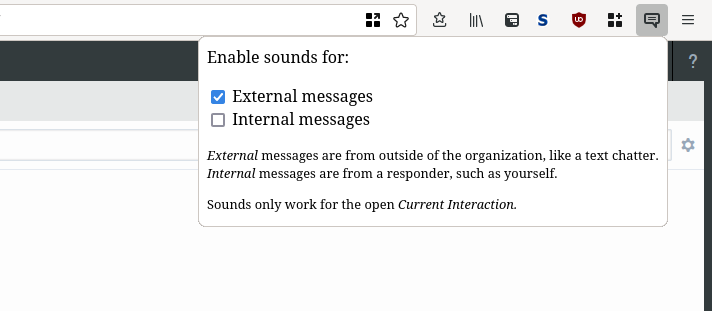

# VCC Message Chime

This is a browser extension to add notification sounds (chimes) to chat messages for text hotline responders at Talk Suicide in Canada. It's designed for use with Genesys *Interaction Connect*, as provided by Rogers.

Configuration for the extension is minimal, accessible through a chat icon added to the top bar in the browser.

Use this link to [add this extension to Firefox](https://github.com/obar/vcc-message-chime/releases/download/v0.1/vcc-message-chime-0-1.xpi).

Extension icon from [Mozilla](https://design.firefox.com/icons/viewer/#). Chime sound from [Aesterial-Arts](https://freesound.org/people/Aesterial-Arts/).
